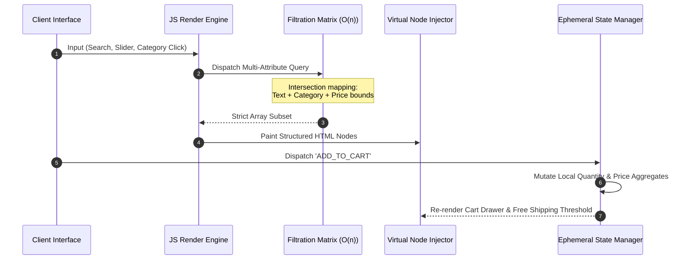

<div align="center">

# 🧥 HypeWear Storefront
### **Zero-Dependency, High-Performance Client-Side SPA Architecture**

[](#)
[](#)
[](#)
[](#)

*An editorial e-commerce matrix demonstrating complex multi-dimensional filtration and ephemeral state management without framework bloat.*

<br />


---
</div>

## 🚨 Core Technical Intent
Modern e-commerce architecture is often paralyzed by dependency bloat (React, Redux, Webpack), leading to poor Core Web Vitals and slow Time-to-Interactive (TTI) on mobile devices. **HypeWear** was engineered as a strict counter-thesis: a premium, high-street streetwear boutique powered entirely by a bespoke, zero-dependency JavaScript render engine. 

It proves mastery over native DOM orchestration, complex matrix filtering, and localized memory persistence.

---

## 🏗️ Systems Architecture & State Flow



---

## ⚡ Engineering Highlights & Paradigms

### 1. Multi-Dimensional Filtration Matrix

The filtering subsystem relies on a strict `O(n)` reduction pipeline rather than chained array mutations. It evaluates intersection attributes (Search Substrings $\cap$ Price Boundaries $\cap$ Category Isolation) in a single pass to ensure sub-millisecond layout recalculations.

* **Strict Boundary Isolation:** Prevents substring collision (e.g., ensuring queries for "Men's" do not bleed into "Women's" arrays) using hard boundary evaluation.

### 2. Ephemeral Cart State Management

Instead of relying on external state libraries, the cart operates on a localized reactive data model.

* It dynamically calculates aggregate pricing, itemized quantities, and handles complex conditional string rendering for automated "Free Worldwide Shipping" threshold calculations in real-time.

### 3. Cumulative Layout Shift (CLS) Mitigation

The UI is strictly tokenized using CSS3 variables and grid boundaries. Product cards utilize `object-fit: cover` and strict inline container bounds to guarantee that high-resolution editorial photography never forces a DOM reflow, regardless of the viewport dimensions.

---

## 🗄️ Strict Data Schema Protocol

To maintain zero-dependency data binding, inventory is structurally mapped as a fixed JavaScript array of objects, acting as an internal JSON API.

```javascript
// Example Node in script.js (Data Source of Truth)
{
  id: 8,
  name: "Shadow Mock-Neck Knit Combo",
  cat: "Men's Stitched",
  price: 6500,
  orig: null,
  badge: "New",
  colors: ["#1a1a1a", "#4a5a3a"],
  sizes: ["S", "M", "L", "XL"],
  desc: "A minimalist structured mock-neck sweater woven from heavy cotton-blend yarns...",
  bg: "#1a1a28",
  image: "images/men1.jpg"
}

```

---

## 🎨 Industrial Zen Design Tokens

The visual layout distances itself from generic e-commerce templates, utilizing an editorial, high-fashion structural grid.

* **Typographic Hierarchy:** `Cormorant Garamond` (Serif) for editorial H1/H2 nodes; `DM Sans` (Sans-Serif) for low-weight UI data and price vectors.
* **Color Matrix:** Deep Charcoals (`#121212`), Warm Creams (`#F5F5F0`), Raw Ochre, and Muted Sage.

---

## 🚀 Deployment & Local Execution

Because HypeWear operates natively on modern browser API specifications, it requires **zero build steps, no Node modules, and no backend configuration.**

### 1. Initialize Workspace

```bash
git clone [https://github.com/YOUR_USERNAME/hypewear-storefront.git](https://github.com/YOUR_USERNAME/hypewear-storefront.git)
cd hypewear-storefront

```

### 2. Execute Local Node

You can open the project natively in any browser, or use a lightweight development server for optimal asset routing:

```bash
# Using Python's native HTTP server (if installed)
python -m http.server 8000

# Or using Node's npx (if installed)
npx serve .

```

### 3. View Port

Navigate to `http://localhost:8000` to interact with the SPA.

---

## 📂 Structural Directory Mapping

```text
hypewear-storefront/
├── index.html       # DOM Skeleton & Overlay Containers
├── style.css        # CSSOM Tokens, Animations, & Active State Swatches
├── script.js        # V8 Render Engine & State Routing
└── images/          # Local Optimized Asset Vault (.jpg & .webp)
    ├── Home.jpg     # Editorial Hero Asset
    ├── men[X].jpg   # Structured Tailoring Catalog Assets
    ├── women[X].jpg # Fluid Draping Catalog Assets
    └── kd[X].jpg    # Kids' Streetwear Assets

```
